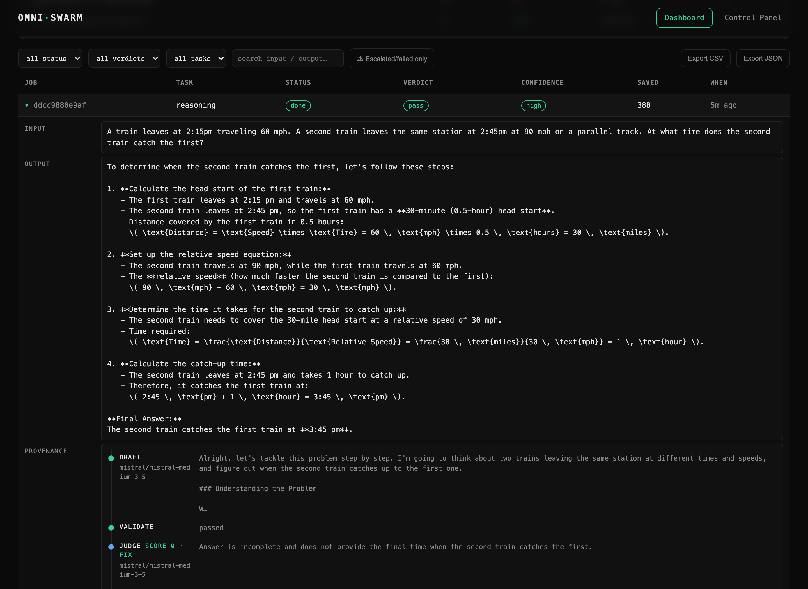
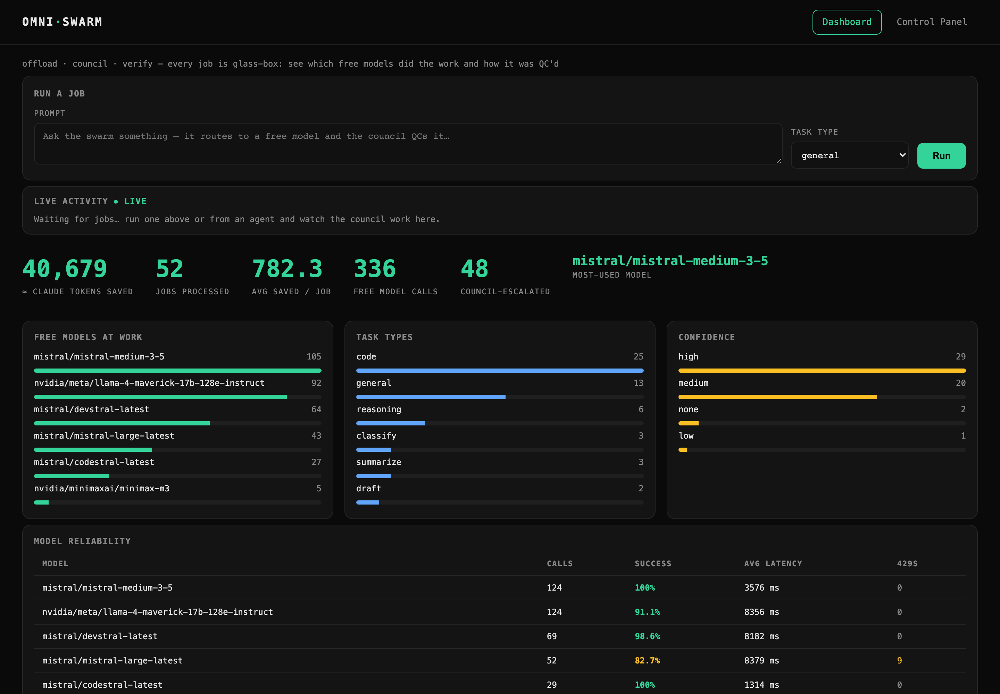
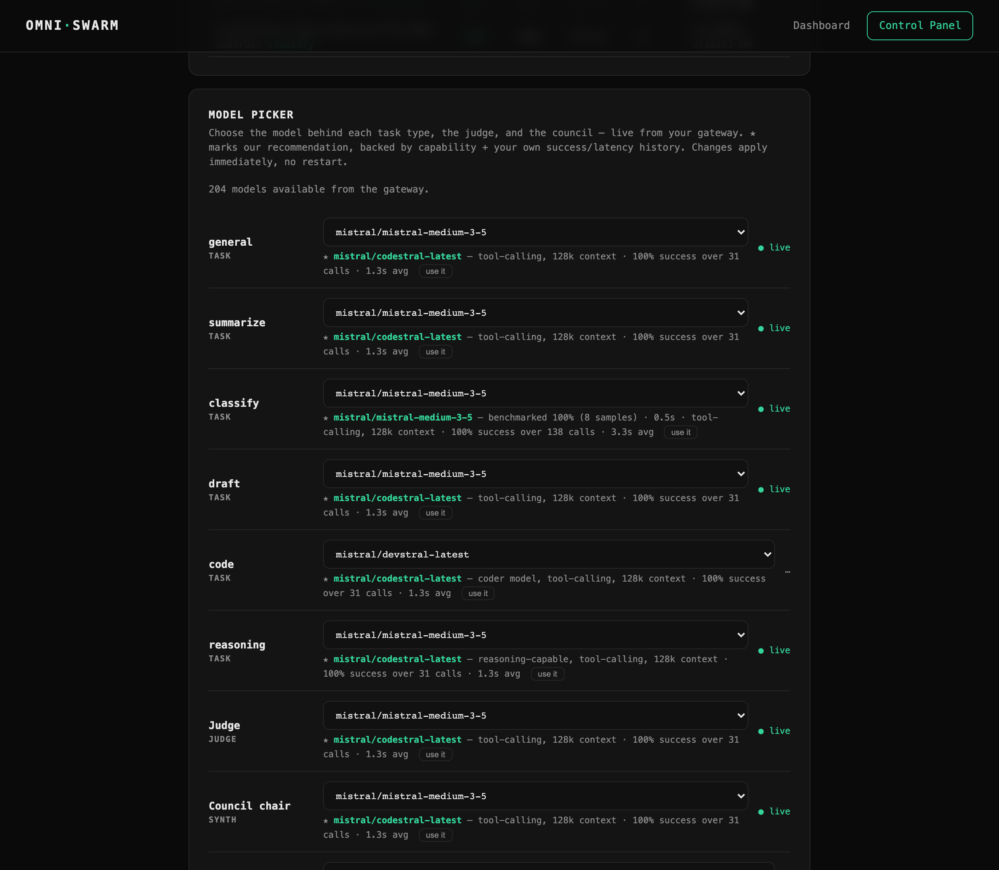

<div align="center">
  

  <p><em>A trust layer over cheap compute.</em></p>

  <a href="https://github.com/ajankuv/omniswarm/actions/workflows/build.yml"></a>
  
  
  
  
</div>

---

Quality AI is expensive. Most teams either pay for every token with a premium model, or accept unverified output from free ones. OmniSwarm closes that gap: keep an expensive orchestrator (Claude, GPT-4, anything) for reasoning and decisions, but offload bulk and templated work to **free models** via an OmniRoute (or any OpenAI-compatible) gateway. Before returning the result, a multi-model council — validators, judge, and a named review board — QCs every answer and issues a confidence verdict. You get verified, trustworthy output without paying for it twice.

The point is access. People who can't afford to run heavy AI on every call can now offload work for free and still get a vetted result back.

## See it work

Every job is glass-box. Below, the judge scores a draft **0**, forces a fix, and the corrected answer ships with a `pass · high` verdict — the full provenance timeline is recorded per job:



The live dashboard tracks tokens saved, which free models did the work, and per-model reliability:



And the Model Picker recommends the best free model per slot — backed by your own benchmarks and success history, applied live with no restart:




---

## What OmniSwarm provides

- **OpenAI-compatible API** (`POST /v1/chat/completions`) — drop-in endpoint; runs the council and returns a standard OpenAI response plus an `omniswarm` block with verdict, confidence, and token savings.
- **Fire-and-forget job API** — submit a job and get an ID immediately; poll for the result, stream live updates via SSE, or export to JSON/CSV.
- **Adaptive-tiered council** — deterministic validators (with an auto-fix attempt) → judge → role-based review board → synthesis. Escalates only when needed; every step is logged as a per-job provenance timeline.
- **Automatic failover** — when a pinned model keeps failing at the gateway, every slot that uses it (task types, judge, council) swaps live to the top-ranked healthy alternative, persisted and reviewable in the Model Picker, with a dashboard banner. Free providers flake; your jobs keep flowing.
- **Verdict calibration** — 👍/👎 any job (dashboard, API, or the MCP `omniswarm_feedback` tool) and OmniSwarm builds a track-record of whether its confidence is *earned*: *"when we say HIGH, we're right 94% of the time."* The confidence signal becomes measurable, not just asserted.
- **Verified-answer cache** — a repeat of a prompt already QC'd to pass + high confidence returns the vetted answer instantly, at $0, with no council call. It caches *trust*, not just text; a 👎 evicts the entry so the cache stays honest.
- **Task types** — `general · summarize · classify · draft · code · reasoning`, each with a pinned model and a QC rubric. `reasoning` always runs the full council.
- **Live dashboard** (`GET /`) — tokens-saved hero stat, searchable/filterable job list with JSON/CSV export, per-job provenance timeline, model leaderboard, and real-time SSE updates.
- **Control Panel** (`GET /control-panel`) — everything configurable live, no restart: API token, rate limit, privacy mode, council roster, scheduled jobs, Model Picker, Benchmark, and active config view.
- **Model configuration two ways** — `omniswarm.toml` for config-driven defaults, or the Model Picker for live runtime overrides (persisted in `omniswarm.runtime.json`, always take precedence).
- **Benchmark** — objective, auto-scored eval banks + judge-scored rubrics. Results decay after 7 days and become the dominant signal in model recommendations while fresh.
- **Scheduling** — recurring jobs on a configurable interval, managed from the Control Panel or the API.
- **MCP server** — native Claude Code tools to delegate, submit, retrieve, and inspect work. Observable mode routes calls through the deployed app so everything surfaces in the dashboard.
- **CLI** — batch a file of prompts through the council with bounded concurrency; JSONL output; one-line summary to stdout.

---

## Requirements

- Python 3.11+
- A reachable OmniRoute (or any OpenAI-compatible) gateway.

---

## Deploy

OmniSwarm is local-first and tiny: 4 runtime dependencies, no external database server required.

### Option A — Docker (recommended)

```bash
docker compose up -d          # builds + runs; open http://localhost:8100
```

- Multi-stage `python:3.12-slim` image (~130–160 MB), runs as a non-root user.
- Jobs and runtime settings persist in the `omniswarm-data` volume (`/data`).
- Point it at your gateway via `OMNISWARM_OMNIROUTE_URL` in `docker-compose.yml`. Optionally mount your own `omniswarm.toml`.
- Plain `docker build -t omniswarm .` works too.

### Option B — pip

```bash
pip install .                 # or: pip install -e ".[dev]" for development
omniswarm-serve               # starts the dashboard + API on 0.0.0.0:8100
```

`omniswarm-serve` honors `OMNISWARM_HOST` / `OMNISWARM_PORT`. You can also run `uvicorn omniswarm.app:app` directly.

---

## Quick start — OpenAI-compatible call

```bash
curl -s http://localhost:8100/v1/chat/completions \
  -H "Content-Type: application/json" \
  -d '{
    "model": "omniswarm",
    "messages": [
      {"role": "system", "content": "You write SEO meta descriptions."},
      {"role": "user",   "content": "Write a meta description for a page about cast iron pans."}
    ],
    "omniswarm": {"task_type": "draft"}
  }' | jq
```

Response: standard OpenAI shape, plus an `omniswarm` extension block:

```json
{
  "choices": [...],
  "omniswarm": {
    "job_id": "...",
    "verdict": "pass",
    "confidence": "high",
    "models_used": ["...", "..."],
    "tokens_saved": 412
  }
}
```

Verdicts are `pass` or `escalated`. Confidence is `high`, `medium`, or `low`. The body accepts `omniswarm.task_type` to route the call to the right model and QC rubric.

---

## Adaptive-tiered council

Every job passes through up to three tiers — it exits as soon as a tier clears it:

| Tier | Role | What it does |
|------|------|--------------|
| **0 — Validators** | Deterministic checks | Apply the task-type rubric; attempt one auto-fix on failure |
| **1 — Judge** | LLM-as-judge | Scores the result against the rubric; decides pass / escalate |
| **2 — Review board** | Named personas | Each member critiques the draft from their role (Developer, PM, Systems Architect by default); a chair model synthesizes into a final verdict |

The council escalates only when needed. A per-job budget caps free model calls. Every step — validator result, judge score, each member's critique, synthesis — is recorded in the job's provenance timeline and visible on the dashboard.

### Role-based review board

Members are defined in `omniswarm.toml` under `[[council.members]]`; the active roster is toggled live in the Control Panel (Council Roster section). You can redefine roles, assign different panels per task type via `[council.roster_overrides]`, and see each member's verdict in the per-job timeline. See `omniswarm.toml.example` for the full schema.

---

## Task types

| Type | Typical use | Council behaviour |
|------|-------------|-------------------|
| `general` | Catch-all | Standard |
| `summarize` | Condensing long content | Judge-scored rubric |
| `classify` | Categorisation | Objective auto-scored |
| `draft` | Writing / copywriting | Judge-scored rubric |
| `code` | Code generation / review | Objective auto-scored |
| `reasoning` | Complex / high-stakes | Always full council |

Each type pins a model and a QC rubric (see `omniswarm/registry.py`). Unknown types fall back to `general`.

---

## Job API

### Submit and poll

```
POST /v1/jobs              → { job_id, status, stream }
GET  /jobs/{id}            → full job record
GET  /jobs                 → list (filter: status, verdict, task_type, q)
GET  /stream               → SSE — live updates for all jobs
GET  /export               → download all jobs (json or csv)
GET  /healthz              → is the gateway reachable?
```

---

## Configuration

### Config file

Copy `omniswarm.toml.example` to `omniswarm.toml` (or set `OMNISWARM_CONFIG=/path/to/it`) and edit model names to match your gateway. Anything you leave out keeps the built-in default. With no config file at all, OmniSwarm runs on its defaults unchanged.

### Key environment variables

| Variable | Purpose |
|----------|---------|
| `OMNISWARM_OMNIROUTE_URL` | Gateway base URL (e.g. `http://your-gateway:20128/v1`) |
| `OMNISWARM_CONFIG` | Path to `omniswarm.toml` |
| `OMNISWARM_RUNTIME` | Path for runtime overrides (default: `omniswarm.runtime.json`) |
| `OMNISWARM_DB_PATH` | SQLite database path |
| `OMNISWARM_MAX_CONCURRENT_JOBS` | Concurrency cap |
| `OMNISWARM_SCHED_INTERVAL` | Scheduler poll interval (seconds) |
| `OMNISWARM_FAILOVER_THRESHOLD` | Consecutive failed gateway calls before auto-failover (default `6` ≈ two failed requests; `0` disables) |
| `OMNISWARM_CACHE` | Verified-answer cache on/off (default `1`) |
| `OMNISWARM_CACHE_TTL` | Seconds a cached answer stays fresh (default `604800` = 7 days; `0` = never expire) |
| `OMNISWARM_CACHE_MIN_CONFIDENCE` | Minimum confidence to cache an answer: `high`/`medium`/`low` (default `high`) |
| `OMNISWARM_CACHE_MAX_ENTRIES` | Hard cap on cached answers; least-used are evicted past it (default `5000`, `0` disables) |
| `OMNISWARM_SAFETY_SCREEN` | Escalate clearly-harmful requests (malware, phishing, weapons, fraud) without generating them (default `1`; `0` to disable, e.g. for security research) |
| `OMNISWARM_SAVINGS_USD_PER_MTOK` | Blended $/1M tokens of the premium model you'd otherwise pay for; drives the dashboard "$ saved" stat (default `5`) |
| `OMNISWARM_REMOTE` | MCP observable mode — route through deployed app |
| `OMNISWARM_REMOTE_TOKEN` | Token for the remote instance (MCP observable mode) |

See `.env.example` for all variables and their defaults.

### Live model configuration — Model Picker

The Control Panel's **Model Picker** lists every model your gateway exposes (live catalog), recommends the best fit per task type / judge / council role, and applies your choice at runtime — no rebuild or restart. Runtime picks persist in `omniswarm.runtime.json` and override `omniswarm.toml` defaults.

Recommendations blend three signals: capability metadata from the gateway's `/models` endpoint, your own success/latency history, and — when available — benchmark scores.

### Automatic failover

Free-tier providers go down without warning. When any pinned model racks up consecutive gateway failures, OmniSwarm automatically swaps **every slot using it** — task types, judge, council chair, members — to the top-ranked healthy alternative (excluding anything currently failing, cooling down, or proven dead). The swap goes through the same persisted runtime-override path as the Model Picker, so it survives restarts and is visible and undoable in the Control Panel. A dismissible banner appears on the dashboard when it fires. There is no silent auto-restore: you switch back via the picker (or let a fresh benchmark make the case).

### Verdict calibration — is the confidence earned?

A confidence label is only useful if it's *true*. Give feedback on any finished job — 👍/👎 in the dashboard job detail, `POST /jobs/{id}/feedback` with `{"correct": true|false}`, or the MCP `omniswarm_feedback(job_id, correct)` tool (so an orchestrator like Claude can grade the answer it just consumed). OmniSwarm buckets every rated job by the confidence it *claimed at the time* and reports how often that was right:

```
GET /calibration
→ { "by_confidence": { "high": {"correct": 293, "wrong": 19, "pct_correct": 93.9, ...}, ... },
    "overall_pct": 88.5, "total_rated": 412 }
```

The dashboard renders this as a calibration curve. It turns *"trust me"* into *"here's my track record."*

### Verified-answer cache

Free providers are cheap but slow, and re-verifying an answer you've already vetted is wasted work. When a job passes at high confidence, OmniSwarm caches the result keyed by an exact-normalized (case/whitespace-insensitive) hash of the system + user prompt + task type. A repeat returns the **vetted** answer instantly — $0, no gateway call, no council — with the cache hit recorded in the job's provenance and a "cached" badge on the dashboard. It caches *trust*, not just text: only `pass` + `high` answers are stored, entries expire after a TTL, and a 👎 (see calibration above) evicts the entry so a bad answer can't keep being served. Disabled automatically under the `redact`/`none` privacy modes so cached text never outlives your privacy setting.

---

## Benchmark

The Control Panel's **Benchmark** tab runs an objective quality eval across free models:

- **Auto-scored banks** for `classify`, `code`, `reasoning`, `general` — verifiable correct/wrong.
- **Judge-scored rubrics** for `summarize`, `draft` — evaluated by the judge model.
- Shows a cost estimate (gateway calls) before running; you confirm before it starts.
- Runs as a background job with live SSE progress. Each candidate has a per-model timeout — a slow or failing model fails its samples without stalling the whole run.
- Results persist and become the **dominant signal** in Model Picker recommendations while fresh, decaying after 7 days so stale numbers don't mislead.

```
POST /benchmark    → start a benchmark run (auth required)
GET  /benchmarks   → list benchmark results
```

---

## Scheduling

Submit recurring jobs from the Control Panel or the API:

```
POST   /schedules              { prompt, task_type, interval_minutes }
GET    /schedules              → list all schedules
DELETE /schedules/{id}
POST   /schedules/{id}/toggle  → enable / disable
```

A scheduler loop runs due jobs through the council. Jobs left in a `running` state after a process restart are recovered automatically.

---

## Privacy — store_mode

Controls what gets persisted to the SQLite jobs log. Set live from the Control Panel (Privacy section); it persists to the runtime settings file (`OMNISWARM_RUNTIME`, default `omniswarm.runtime.json`).

| Mode | Input / result stored as | Provenance |
|------|--------------------------|------------|
| `full` (default) | verbatim | full timeline |
| `redact` | `[redacted: N chars]` | `[]` |
| `none` | `""` | `[]` |

Non-sensitive metadata (verdict, confidence, models_used, tokens_saved) is always kept regardless of mode. Token savings are computed from the real text before any redaction.

---

## Control Panel

Open at `GET /control-panel` (linked in the top nav). All settings take effect immediately, no restart needed.

| Section | What you can configure |
|---------|----------------------|
| **Access & Security** | API token; rate limit (requests/min, 0 = off) |
| **Privacy** | `store_mode` |
| **Council Roster** | Tick which review board members are active |
| **Scheduled Jobs** | Create / manage recurring jobs |
| **Model Picker** | Choose model per task type / judge / chair / each council member from the live gateway catalog; recommendations shown per slot; availability probe |
| **Benchmark** | One-click quality benchmark with live progress |
| **Active Configuration** | Read-only view of current gateway URL, model map, and council roster |

### API token

Once set, every data and mutating endpoint (`/v1/chat/completions`, `/v1/jobs`, `/stats`, `/jobs`, `POST /settings`, etc.) requires the token via:
- HTTP header: `Authorization: Bearer <token>`
- Query string: `?token=<token>`

`GET /` (the dashboard HTML) always stays public; its JavaScript supplies the token on subsequent fetches automatically (stored in `localStorage`). To remove the token, POST an empty string.

---

## Security posture

OmniSwarm assumes a trusted LAN. The OmniRoute gateway is reached with **no auth header** (an empty key is required — sending a real key returns zero models), so never put a real key there. If you expose OmniSwarm beyond localhost or your LAN, set an API Token (Control Panel → Access & Security); every data and mutating endpoint then requires it. Note that `GET /settings` returns non-secret configuration (gateway URL, model map, council roster) unauthenticated by design so the dashboard can bootstrap — another reason not to expose an instance without a token.

---

## Use from Claude — MCP server

OmniSwarm ships an MCP server so Claude Code can delegate work natively.

```bash
pip install -e ".[mcp]"
claude mcp add omniswarm -- "$(pwd)/.venv/bin/omniswarm-mcp"
```

Claude then has a full workhorse toolset:

| Tool | What it does |
|------|-------------|
| `omniswarm_delegate(task, task_type)` | Offload to free models, QC'd by council — **blocks** and returns the vetted answer + confidence verdict |
| `omniswarm_submit(task, task_type)` | Fire-and-forget — returns a `job_id` immediately; council runs in background |
| `omniswarm_result(job_id)` | Collect outcome (verdict / confidence / result), or `"running"` if not done |
| `omniswarm_list_jobs(limit, status)` | Recent jobs from the shared store |
| `omniswarm_recommend(task_type)` | Best free model for a task, from the live catalog + success/latency history |
| `omniswarm_list_task_types()` | Available task types and the model each uses |
| `omniswarm_stats()` | How much has been offloaded and approximately how many Claude tokens saved |

**Typical fire-and-forget pattern:** `omniswarm_submit` several tasks, continue reasoning on other things, then call `omniswarm_result` per job_id when you need the answers. Background jobs use whatever models you picked in the Control Panel.

### Observable mode

Set `OMNISWARM_REMOTE=http://<host>:8100` (and `OMNISWARM_REMOTE_TOKEN` if the instance is protected) when registering the MCP server. In observable mode, the job tools (`delegate` / `submit` / `result` / `list_jobs`) route **through the deployed app**, so Claude's offloaded work appears in the dashboard — live timeline, provenance, stats — and uses your configured models.

By default the server runs in-process and talks to OmniRoute directly. The HTTP service does not need to be running in default mode. In observable mode, the `:8100` instance must be up.

---

## Batch from the CLI

Offload a whole file of prompts at once. Your orchestrator only ever sees the summary:

```bash
pip install -e .
printf "Write a meta description for cast iron pans\nWrite one for bamboo cutting boards\n" > tasks.txt
omniswarm submit tasks.txt --task-type draft --out results.jsonl --concurrency 4
```

Each line is processed through the council. Full results — vetted text, verdict, confidence, tokens saved — are written to `results.jsonl`. A one-line summary prints to stdout. Concurrency is bounded by `--concurrency`.

---

## Reliability and stats

```
GET /reliability    → per-model success%, latency, 429 count
GET /stats          → aggregate offload totals and tokens saved
```

Both are surfaced in the live dashboard's model leaderboard section.

---

## Roadmap — coming soon

- **Multi-gateway support** — register several OpenAI-compatible gateways at once (OmniRoute + Ollama + OpenRouter free tier) with per-gateway model namespaces.
- **Dollar-value savings** — translate tokens saved into "≈ $X vs premium-model pricing" on the dashboard.
- **Job webhooks** — notify ntfy/Discord/anything on done / failed / escalated.
- **A/B compare mode** — run one prompt across several models side-by-side and let the council judge the winner.
- **Client-facing streaming** on `/v1/chat/completions`.
- **OpenClaw integration** — ship the MCP toolset as an OpenClaw skill for $0 offload + verification in agent workflows.

Ideas and issues welcome.
